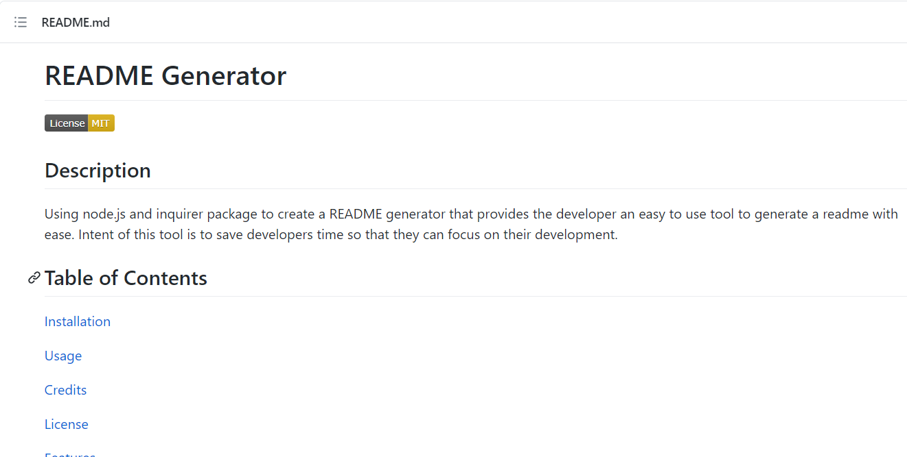

# README Generator III

## Description
Using node.js and inquirer package to create a README generator that provides the developer an easy to use tool to generate a readme with ease. Intent of this tool is to save developers time so that they can focus on their development.

## Table of Contents

 [Installation](README.md#Installation) 

 [Usage](README.md#Usage) 

 [Credits](README.md#Credits) 

 [License](README.md#License) 

 [Features](README.md#Features) 

 [Contributing](README.md#Contributing) 

 [Tests](README.md#Tests) 

 [Questions](README.md#Questions) 

## Installation
1. Download and install Node.js if not already from nodejs.org.
2. Once node.js is installed, go to https://www.github.com/htang2021/readme-gen and do a git pull from the directory where this app is to be installed at.
3. Verify package.json is in the root directory of this app and contains the "inquirer" package as one of its dependencies.
4. From the CLI prompt ($ denotes the CLI prompt), initialize npm with $ npm init 
5. Run $ npm install
6. All dependencies should've been installed.  Verify that node_modules directory is created and inquirer is listed in one of the packages.
7. Create the following directories: ./assets, ./assets/images, ./dist
8. Place a mock-up image of your project that you want to have it shown on the README file in the ./assets/images/ directory
9. Run $ node index.js
10. Answer to each of the questions accordingly and with as much details as appropriate for the README.
11. Locate the generated README.md file in the ./dist production distribution directory and verify that all responses were captured accurately.
12. Take the steps to add, commit, and push to your project git repo accordingly.

## Usage
1. Git pull the readme-gen repo and npm install to install dependencies.
2. From CLI, run '$ node index.js' 
3. Answer each of the questions prompted with as much details as possible.
4. Some questions will launch your local editor where you can provide a formatted multi-line input. 
5. Once all questions are answered, a README will be created in your ./dist directory.
6. Verify README content with a markdown interpreter or via github in your repository.

    
    

## Credits
Thank you for the following collaborators that helped build this app:

Hung Tang

## License
This project is under the terms of the following license: 
[GNU GPLv3](https://www.gnu.org/licenses/gpl-3.0.en.html)

## Features
- README generator application
- Table of content list can be created dynamically thru a set list of questions
- Mock-up image of the project can be embedded into README if placed in ./assets/images directory
- Badges are added to the top of README and in the License section
- Date is added at the bottom of the README that shows when the README is created

## Contributing
Adopting to Contributor Covenant!

## Tests
- Run through all of the questions and selectively respond to make sure README is created based on the responses accurately.
- Select different license options and verify that the license is listed and link created are all accurate.
- Use un-ordered list on the editor and ordered list to verify that they are created accordingly
- Remove and restore project mock-up image in the ./assets/images directory and verify the outcome on README
- Through license selection, verify that the badge for each of the license options is shown correctly.
- Run through the questions and don't respond to any and verify that the required questions will prompt repeatedly until a response is provided.

## Questions
Git Profile: [htang2021](https://www.github.com/htang2021/)

Any questions or recommendations on this app, please feel free to reach out to [Me](mailto:hungtang@hotmail.com).

Last updated: Mon Apr 05 2021 00:10:05 GMT-0700 (Pacific Daylight Time)
